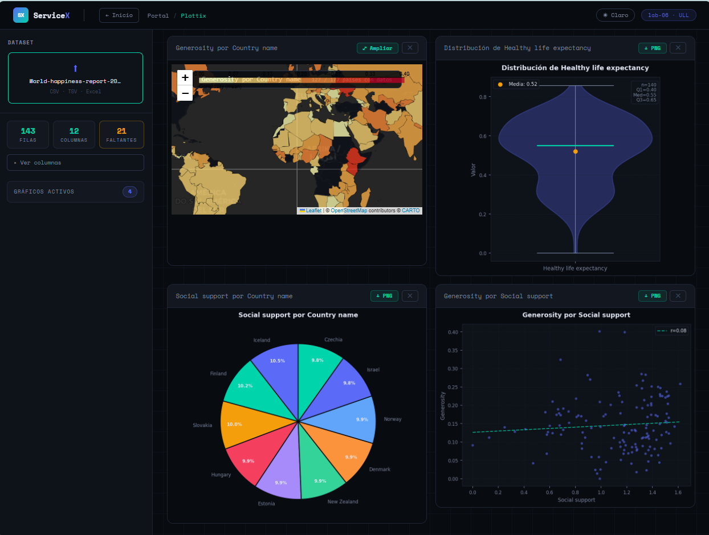
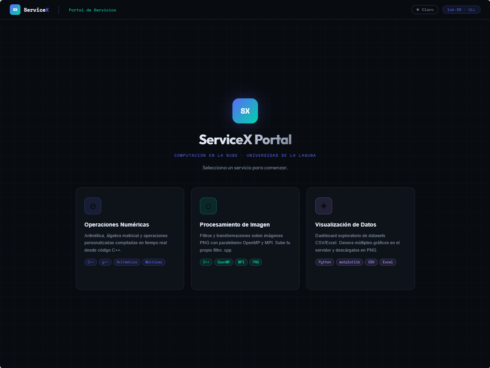

# Plottix Visualizer

**Máster en Ingeniería Informática — Universidad de La Laguna**  
Asignatura: Análisis de Datos Masivos



> 📷 *Interfaz de visualización de datos*

---

## ¿Qué es esto?

Plottix es un framework de exploración y visualización de datos desarrollado como práctica de la asignatura de Análisis de Datos Masivos. Permite cargar datasets en formato CSV, TSV o Excel, gestionar valores faltantes, y generar múltiples gráficos de forma interactiva.

El repositorio contiene dos versiones del sistema:

- **Plottix standalone** (`/backend` + `/frontend`) — versión original con rendering en el navegador mediante Recharts.
- **ServiceX Portal** (`/portal` + `/servicex-backend` + `/plottix-service`) — versión orientada a servicios, desarrollada también como práctica de Computación en la Nube. Integra Plottix como un servicio dentro de un portal unificado junto con dos servicios de computación C++ (operaciones numéricas y procesamiento de imagen con MPI/OpenMP).

---

## Gráficos disponibles

| Tipo | Variables requeridas |
|---|---|
| Bar Chart | X categórica · Y numérica |
| Line Chart | X numérica · Y numérica |
| Scatter Plot | X numérica · Y numérica (+ línea de regresión) |
| Histogram | Y numérica |
| Pie Chart | X categórica · Y numérica opcional |
| Box Plot | X categórica · Y numérica |
| Density Curve (KDE) | Y numérica |
| Violin Plot | Y numérica |
| Correlogram | 2+ columnas numéricas |
| Mapa Coroplético | X categórica (país) · Y numérica — mapa interactivo Folium |

---

## Estructura del repositorio

```
Plottix-Visualizer/
│
├── docker-compose.yml          ← levanta el portal completo (recomendado)
│
├── backend/                    ← Plottix standalone: FastAPI + Recharts
│   ├── main.py
│   ├── parsers/                ← CSV, TSV, Excel
│   ├── visualizers/            ← patrón Strategy, un fichero por gráfico
│   └── requirements.txt
│
├── frontend/                   ← Plottix standalone: React + Vite + Recharts
│   └── src/
│       ├── App.jsx
│       ├── tokens.js           ← paleta de colores centralizada
│       └── components/
│
├── servicex-backend/           ← ServiceX: Flask + compilador C++ (g++/mpic++)
│   ├── app.py
│   ├── binaries/               ← código fuente C++ de las operaciones
│   └── descriptors/            ← JSON autodescriptivos de cada servicio
│
├── plottix-service/            ← Plottix como servicio cloud
│   ├── backend/                ← Flask + matplotlib + Folium + GeoPandas
│   │   ├── app.py
│   │   ├── descriptor.json     ← descriptor compatible con ServiceX
│   │   └── visualizers/
│   │       └── factory.py      ← genera PNG (matplotlib) o HTML (Folium)
│   └── frontend/               ← React standalone del servicio Plottix
│
├── portal/                     ← SPA unificada: los 3 servicios en una interfaz
│   └── src/
│       ├── App.jsx             ← router: home / operaciones / imágenes / plottix
│       ├── global.css          ← tema oscuro/claro con variables CSS
│       ├── hooks/
│       │   └── useTheme.js     ← toggle oscuro/claro persistente
│       ├── services/
│       │   └── api.js          ← cliente para ServiceX (5001) y Plottix (5002)
│       └── components/
│           ├── HomePage.jsx    ← selector de servicios
│           ├── operations/     ← vista operaciones numéricas
│           ├── images/         ← vista procesamiento de imagen
│           └── visualize/      ← dashboard Plottix integrado
│
└── docs/
    └── architecture.md         ← arquitectura software del sistema
```

---

## Requisitos previos

- [Docker Desktop](https://www.docker.com/products/docker-desktop/) instalado y en ejecución
- Puertos `3000`, `5001` y `5002` libres

---

## Puesta en marcha

### Portal completo (recomendado)

Levanta los tres servicios con un solo comando desde la raíz del proyecto:

```bash
docker compose up -d --build
```

| Servicio | URL |
|---|---|
| Portal (interfaz unificada) | http://localhost:3000 |
| ServiceX backend | http://localhost:5001 |
| Plottix backend | http://localhost:5002 |

Para parar:

```bash
docker compose down
```

### Plottix standalone (versión original)

```bash
cd backend
pip install -r requirements.txt
uvicorn main:app --reload --port 8000

# En otra terminal:
cd frontend
npm install
npm run dev
```

Accede en http://localhost:5173

---

## Cómo usar el portal

1. Abre http://localhost:3000
2. En la **página de inicio** elige uno de los tres servicios:
   - **Operaciones Numéricas** — ejecuta operaciones aritméticas y matriciales compiladas en C++. Puedes subir tu propio fichero `.cpp` para registrar un nuevo servicio en tiempo real.
   - **Procesamiento de Imagen** — aplica filtros sobre imágenes PNG con paralelismo OpenMP o MPI. También admite filtros `.cpp` personalizados.
   - **Visualización de Datos (Plottix)** — sube un dataset CSV o Excel, gestiona valores faltantes y genera múltiples gráficos. El botón **+ Añadir gráfico** abre el configurador, donde solo se muestran las columnas compatibles con el tipo de gráfico seleccionado.

El toggle **☀ Claro / ☾ Oscuro** en el header cambia entre temas. La preferencia se guarda en el navegador.



> 📷 *Página de inicio del portal de ServiceX*
---

## Tecnologías

### Portal / frontend
| Tecnología | Uso |
|---|---|
| React 18 | Framework de UI |
| CRA (Create React App) | Toolchain del portal |
| Vite | Toolchain del frontend standalone |
| CSS variables | Sistema de tokens de diseño (tema oscuro/claro) |

### Plottix backend (servicio)
| Tecnología | Uso |
|---|---|
| Flask 3 | Servidor HTTP |
| pandas 2.2 | Carga y procesamiento de datos |
| matplotlib 3.9 | Generación de gráficos PNG en servidor |
| seaborn 0.13 | Gráficos estadísticos |
| scipy 1.13 | KDE, regresión lineal |
| GeoPandas 0.14 | Geometrías de países para el mapa coroplético |
| Folium 0.17 | Mapa interactivo con tooltips hover |
| gevent + gunicorn | Servidor WSGI asíncrono de producción |

### Plottix backend (standalone)
| Tecnología | Uso |
|---|---|
| FastAPI | Servidor HTTP |
| Recharts | Renderizado de gráficos en el navegador |
| Leaflet | Mapa coroplético interactivo |

### ServiceX backend
| Tecnología | Uso |
|---|---|
| Flask 3 | Servidor HTTP |
| g++ / mpic++ | Compilación de servicios C++ en tiempo real |
| OpenMP / MPI | Paralelismo para procesamiento de imagen |

---

## Notas

- Las sesiones de usuario se guardan en memoria en el backend de Plottix — no se persisten entre reinicios del contenedor.
- El mapa coroplético (Folium) es el único gráfico que devuelve HTML interactivo en lugar de PNG. Se renderiza en un `<iframe>` dentro de la tarjeta. El botón **⤢ Ampliar** lo abre a pantalla completa.
- Los gráficos PNG se pueden descargar directamente desde el botón **↓ PNG** de cada tarjeta.
- Para añadir un nuevo tipo de gráfico basta con implementar `_chart_<tipo>` en `plottix-service/backend/visualizers/factory.py`, añadirlo en `/api/chart-types` y registrar su regla de ejes en `tokens.js`.