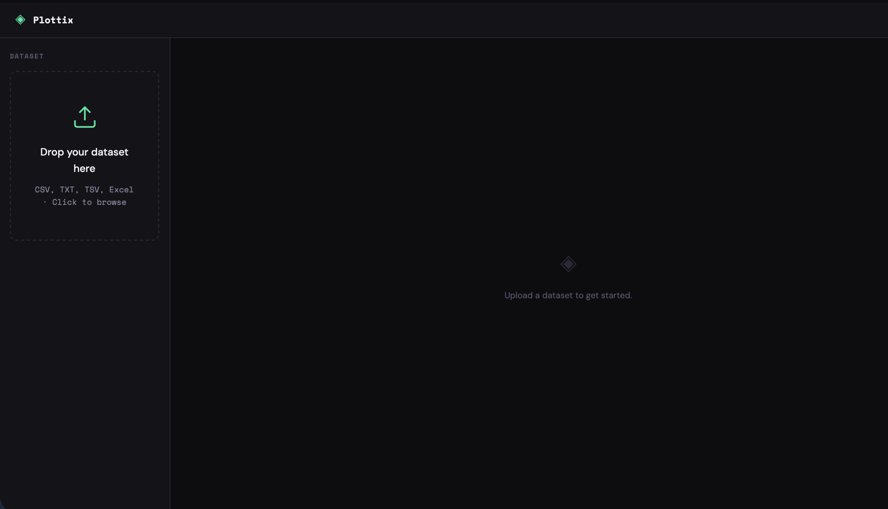
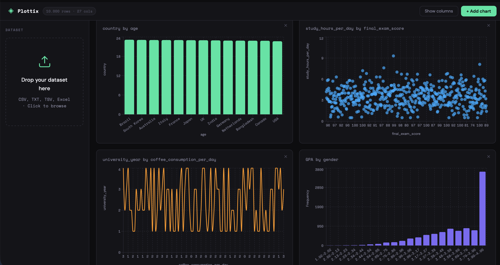
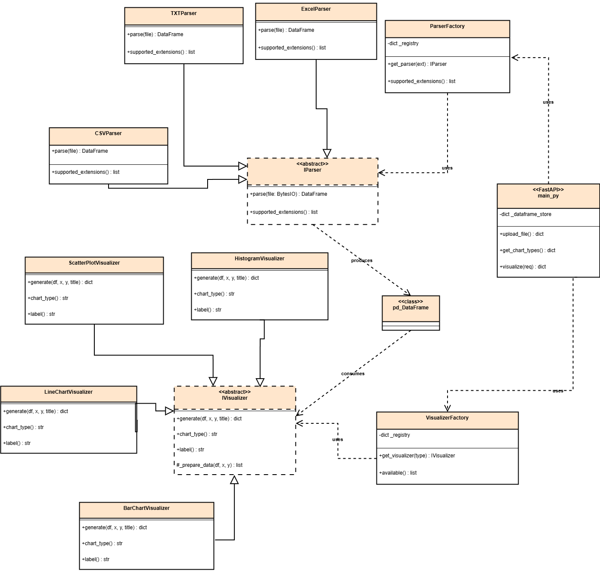
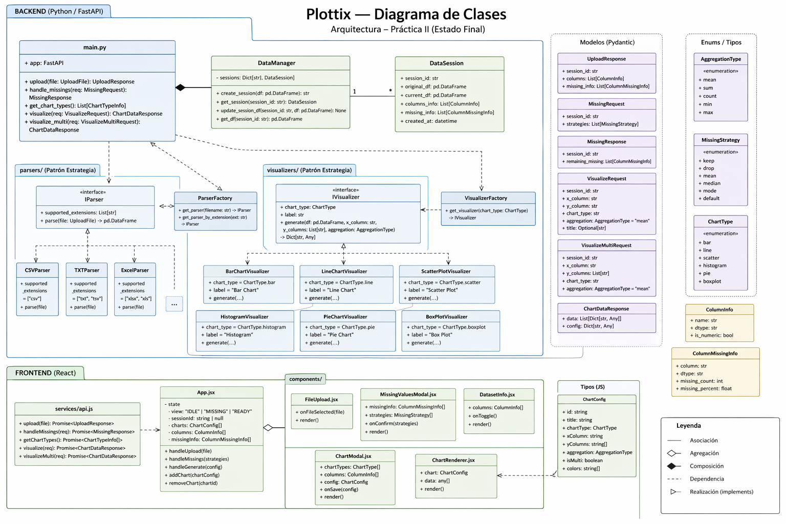

# Plottix — Generic Dataset Visualizer

Aplicación web para visualización interactiva de datasets genéricos. Desarrollada con **React** en el frontend y **Python (FastAPI)** en el backend, orquestada con **Docker Compose**, e implementando el **Patrón de Estrategia** tanto para el parseo de ficheros como para la generación de gráficos.

---

## Capturas

### Estado inicial



> 📷 *Interfaz vacía antes de subir un dataset*

### Demo con gráficas



> 📷 *Varios gráficos generados sobre el dataset de ejemplo*

---

---

# Práctica de Visualización de Datos I

## Arquitectura

```
plottix/
├── docker-compose.yml
├── backend/
│   ├── main.py                     # FastAPI — endpoints REST
│   ├── requirements.txt
│   ├── Dockerfile
│   ├── parsers/
│   │   ├── iparser.py              # ◆ Interfaz IParser (Strategy)
│   │   ├── csv_parser.py           # Estrategia: CSV (auto-detecta separador)
│   │   ├── txt_parser.py           # Estrategia: TXT / TSV
│   │   ├── excel_parser.py         # Estrategia: Excel (.xlsx, .xls)
│   │   └── factory.py              # Factory — resuelve parser por extensión
│   └── visualizers/
│       ├── ivisualizer.py          # ◆ Interfaz IVisualizer (Strategy)
│       ├── bar_chart.py            # Estrategia: Bar Chart
│       ├── line_chart.py           # Estrategia: Line Chart
│       ├── scatter_plot.py         # Estrategia: Scatter Plot
│       ├── histogram.py            # Estrategia: Histogram
│       └── factory.py              # Factory — resuelve visualizador por tipo
└── frontend/
    ├── index.html
    ├── vite.config.js
    ├── package.json
    ├── Dockerfile
    └── src/
        ├── main.jsx
        ├── App.jsx                 # Layout principal + estado global
        ├── index.css               # Variables CSS y estilos base
        ├── services/
        │   └── api.js              # Capa de comunicación con el backend
        └── components/
            ├── FileUpload.jsx      # Zona de drag & drop
            ├── DatasetInfo.jsx     # Chips de columnas y tipos
            ├── ChartModal.jsx      # Modal de configuración de gráfico
            └── ChartRenderer.jsx  # Renderizado con Recharts
```

## Patrón de Estrategia

El patrón se aplica en dos ejes independientes del sistema.

### Parsers de ficheros

```
IParser  (ABC)
    ├── CSVParser       →  .csv          (detecta separador , ; \t)
    ├── TXTParser       →  .txt  .tsv    (tab y whitespace)
    └── ExcelParser     →  .xlsx  .xls
```

`ParserFactory` recibe la extensión del fichero subido y devuelve la instancia correcta sin que el cliente conozca la implementación concreta.

### Visualizadores

```
IVisualizer  (ABC)
    ├── BarChartVisualizer
    ├── LineChartVisualizer
    ├── ScatterPlotVisualizer
    └── HistogramVisualizer
```

`VisualizerFactory` resuelve el tipo de gráfico seleccionado en el frontend y aplica la estrategia correspondiente. Cada estrategia implementa `generate()`, que detecta automáticamente si las columnas son numéricas o categóricas y agrega los datos de forma coherente.

## API REST

| Método | Ruta | Descripción |
|--------|------|-------------|
| `POST` | `/upload` | Sube un fichero y devuelve `session_id`, columnas y tipos |
| `GET` | `/chart-types` | Lista los tipos de gráfico disponibles |
| `POST` | `/visualize` | Genera los datos del gráfico para las columnas seleccionadas |

Documentación interactiva disponible en `http://localhost:8000/docs` (Swagger UI).

## Flujo de uso

```
1. Upload    →  Arrastra o selecciona un fichero CSV / TXT / Excel
2. Inspect   →  Pulsa "Show columns" en el header para ver columnas y tipos
3. Configure →  Pulsa "+ Add chart" → selecciona X, Y y tipo de gráfico
4. Visualize →  El gráfico aparece en el panel derecho
5. Repeat    →  Añade tantos gráficos como necesites; se organizan en grid
```

## Diagrama de clases — Práctica I



> 📷 *Diagrama de clases UML de la arquitectura implementada en la Práctica I*

---

---

# Práctica de Visualización de Datos II

Las mejoras de esta práctica se dividen en dos bloques: corrección y enriquecimiento del pipeline de carga de datos, y ampliación del catálogo de visualizaciones.

---

## Bloque 1 — Tratamiento de missings y operaciones de agregación

Durante las clases prácticas de la asignatura se señaló que la versión anterior no trataba correctamente los datasets con valores ausentes. Un dataset cargado con missings podía producir gráficos silenciosamente incorrectos o errores en el backend. Además, la agregación de datos numéricos estaba hardcodeada a la media, sin permitir al usuario elegir la operación.

### Detección y limpieza de missings

Se añade un **paso intermedio obligatorio** entre la subida del fichero y la pantalla de visualización. Tras el upload, el sistema analiza el DataFrame y devuelve un resumen de missings por columna (conteo, porcentaje, tipo de dato). El usuario ve una nueva pantalla — `MissingValuesModal` — con una tabla interactiva donde puede elegir una estrategia de tratamiento columna a columna antes de proceder.

Las estrategias disponibles son:

| Estrategia | Descripción | Aplica a |
|---|---|---|
| `Keep as-is` | Deja los missings sin tocar | Todas |
| `Drop rows` | Elimina las filas donde la columna es nula | Todas |
| `Fill mean` | Rellena con la media de la columna | Numéricas |
| `Fill median` | Rellena con la mediana de la columna | Numéricas |
| `Fill mode` | Rellena con el valor más frecuente | Todas |
| `Fill default` | Rellena con `0` (numéricas) o `"N/A"` (texto) | Todas |

Las opciones `mean` y `median` se ocultan automáticamente en el selector de columnas categóricas. El sidebar muestra un resumen de missings residuales una vez aplicadas las estrategias.

**Nuevo endpoint:** `POST /handle-missings`

```json
{
  "session_id": "...",
  "strategies": [
    { "column": "sleep_hours", "strategy": "mean" },
    { "column": "country",     "strategy": "mode" }
  ]
}
```

**Cambios en** `/upload`: ahora devuelve adicionalmente el campo `missing_info` con el análisis por columna.

### Operaciones de agregación

En la versión anterior, cuando se representaba una columna numérica agrupada por una categórica, el backend aplicaba siempre la **media**. Ahora el usuario puede elegir la operación desde el modal de configuración del gráfico.

Las operaciones disponibles son `mean`, `sum`, `count`, `min` y `max`. El selector aparece únicamente para los tipos de gráfico donde la agregación es relevante (Bar Chart, Line Chart y Pie Chart). Para Scatter Plot e Histogram la agregación no aplica.

**Cambio en** `/visualize`: acepta el parámetro opcional `aggregation` (por defecto `"mean"`).

### Arquitectura actualizada — Bloque 1

```
plottix/
├── backend/
│   ├── main.py                     # + POST /handle-missings
│   │                               # + aggregation en POST /visualize
│   └── visualizers/
│       └── ivisualizer.py          # _prepare_data acepta aggregation
└── frontend/
    └── src/
        ├── App.jsx                 # Flujo: IDLE → MISSING → READY
        ├── services/
        │   └── api.js              # + handleMissings(), aggregation en visualize()
        └── components/
            ├── MissingValuesModal.jsx   # ◆ Nuevo — tabla de estrategias
            └── ChartModal.jsx           # + selector de agregación
```

---

## Bloque 2 — Nuevos tipos de gráfico y series múltiples

El catálogo original de cuatro gráficos (Bar, Line, Scatter, Histogram) no permitía comparar varias métricas simultáneamente ni representar distribuciones de forma estadísticamente completa. Este bloque añade comparación multi-serie, un Pie Chart y un Box Plot.

### Series múltiples (Multi-Bar y Multi-Line)

Para Bar Chart y Line Chart se añade un **toggle "Compare multiple Y columns"** en el modal de configuración. Al activarlo, el selector de Y cambia a un picker multi-selección con colores por serie. El usuario puede elegir 2 o más columnas numéricas; el gráfico resultante muestra una barra o línea por cada columna seleccionada sobre el mismo eje X, con leyenda automática.

**Nuevo endpoint:** `POST /visualize-multi`

```json
{
  "session_id": "...",
  "x_column":   "university_year",
  "y_columns":  ["study_hours_per_day", "sleep_hours", "social_media_hours"],
  "chart_type": "line",
  "aggregation": "mean"
}
```

Devuelve los datos en formato `[{ "x": "1", "study_hours_per_day": 4.2, "sleep_hours": 6.8, ... }]`, que Recharts consume nativamente para series múltiples.

### Pie Chart

Representa partes de un todo. X categórico + Y numérico (con la agregación elegida), o conteo de X si Y también es categórico. Se limita a 12 slices para mantener la legibilidad. Soporta todas las operaciones de agregación.

**Nuevo visualizador:** `pie_chart.py`

### Box Plot

Representa la distribución estadística completa de una variable numérica (Y) por grupos categóricos (X). Por cada grupo calcula:

- **Q1 / Q3** — caja intercuartílica (IQR)
- **Mediana** — línea verde dentro de la caja
- **Media** — punto naranja
- **Whiskers** — rango 1.5×IQR
- **Outliers** — puntos rojos fuera de los whiskers (máx. 20 por grupo, con jitter horizontal)

El Box Plot se implementa con **SVG puro** (no Recharts) dado que Recharts no expone la función de escala Y en shapes personalizados. El SVG calcula su propia escala Y a partir del dominio de los datos, con la leyenda posicionada en el margen derecho para evitar solapamientos.

**Nuevo visualizador:** `boxplot.py`

### Arquitectura actualizada — Bloque 2

```
plottix/
├── backend/
│   ├── main.py                     # + POST /visualize-multi
│   └── visualizers/
│       ├── pie_chart.py            # ◆ Nuevo
│       ├── boxplot.py              # ◆ Nuevo
│       └── factory.py              # Registra PieChart y BoxPlot
└── frontend/
    └── src/
        ├── App.jsx                 # handleGenerate enruta a visualize / visualize-multi
        ├── services/
        │   └── api.js              # + visualizeMulti()
        └── components/
            ├── ChartModal.jsx      # + toggle multi-Y, picker con colores, pie/boxplot
            └── ChartRenderer.jsx  # + multi_bar, multi_line, pie, boxplot (SVG)
```

## API REST — estado final

| Método | Ruta | Descripción |
|--------|------|-------------|
| `POST` | `/upload` | Sube fichero; devuelve `session_id`, columnas, tipos y `missing_info` |
| `POST` | `/handle-missings` | Aplica estrategias de limpieza por columna |
| `GET` | `/chart-types` | Lista los tipos de gráfico disponibles |
| `POST` | `/visualize` | Genera gráfico single-Y con agregación opcional |
| `POST` | `/visualize-multi` | Genera gráfico multi-Y (bar o line) |

## Catálogo de visualizaciones — estado final

| Tipo | Multi-Y | Agregación | Requisitos de columnas |
|------|---------|-----------|------------------------|
| Bar Chart | ✓ | ✓ | X cualquiera · Y numérica |
| Line Chart | ✓ | ✓ | X cualquiera · Y numérica |
| Scatter Plot | — | — | X numérica · Y numérica |
| Histogram | — | — | Y numérica |
| Pie Chart | — | ✓ | X categórica · Y numérica o categórica |
| Box Plot | — | — | X categórica · Y numérica |

## Flujo de uso — estado final

```
1. Upload    →  Arrastra o selecciona un fichero CSV / TXT / Excel
2. Missings  →  Revisa los valores ausentes y elige estrategia por columna
3. Inspect   →  Pulsa "Show columns" para ver columnas y tipos
4. Configure →  Pulsa "+ Add chart":
                  · Elige tipo de gráfico
                  · Activa "Compare multiple Y" para multi-serie (bar/line)
                  · Selecciona columnas X e Y
                  · Elige operación de agregación si aplica
                  · Escribe un título opcional
5. Visualize →  El gráfico aparece en el panel derecho
6. Repeat    →  Los gráficos se organizan en grid de hasta 2 columnas
```

## Diagrama de clases — Práctica II



> 📷 *Diagrama de clases UML de la arquitectura ampliada en la Práctica II*

---

---

## Puesta en marcha

### Requisitos

- Docker Desktop instalado y en ejecución
- Puertos `3000` y `8000` libres

### Arrancar

```bash
# Clonar / descomprimir el proyecto y entrar en la carpeta raíz
cd plottix

# Primera vez (descarga imágenes y construye)
docker compose up --build

# Siguientes veces
docker compose up
```

| Servicio | URL |
|----------|-----|
| Frontend | http://localhost:3000 |
| Backend API | http://localhost:8000 |

### Parar

```bash
docker compose down
```

---

## Extender la aplicación

### Añadir un nuevo formato de fichero

1. Crear `backend/parsers/json_parser.py` extendiendo `IParser`
2. Implementar `parse()` y `supported_extensions`
3. Importarlo y registrarlo en `parsers/factory.py`

```python
class JSONParser(IParser):
    @property
    def supported_extensions(self): return ["json"]
    def parse(self, file): return pd.read_json(file)
```

### Añadir un nuevo tipo de gráfico

1. Crear `backend/visualizers/my_chart.py` extendiendo `IVisualizer`
2. Implementar `generate()`, `chart_type` y `label`
3. Registrarlo en `visualizers/factory.py`
4. Añadir el case correspondiente en `ChartRenderer.jsx`

El endpoint `/chart-types` lo expondrá automáticamente al frontend sin ningún cambio adicional.

---

## Stack tecnológico

| Capa | Tecnología |
|------|-----------|
| Frontend | React 18 + Vite |
| Gráficos | Recharts + SVG puro (Box Plot) |
| HTTP client | Axios |
| Backend | Python 3.12 + FastAPI |
| Data processing | Pandas + NumPy |
| Contenerización | Docker + Docker Compose |